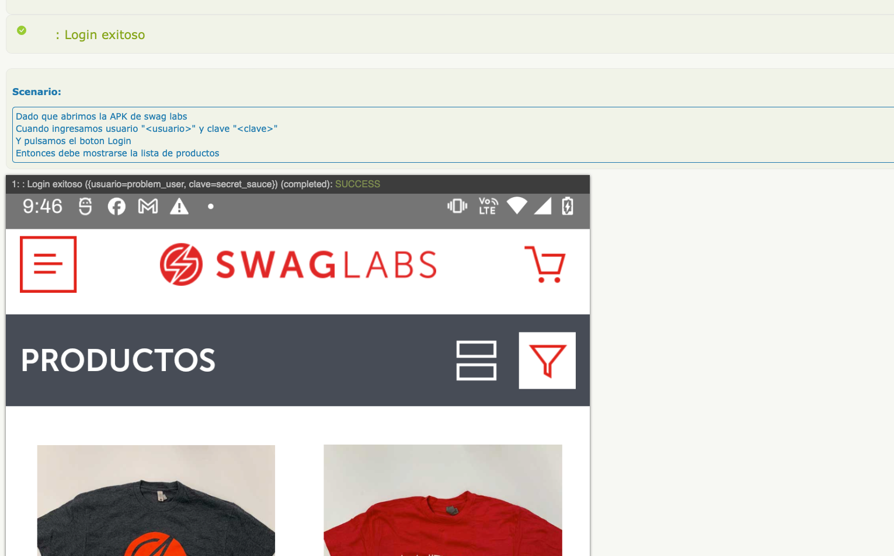
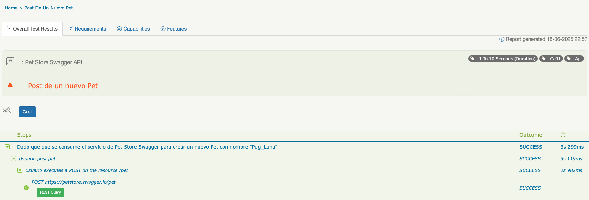

# Proyecto de Automatización QA: API, Web y Mobile

Este repositorio contiene pruebas automatizadas para aplicaciones **API (Pet Store Swagger)**, **Web DemoBlaze** y **Mobile en Swag Labs app**, utilizando un enfoque basado en **Java**, **Serenity BDD**, **Screenplay**, **Cucumber** y **Gradle**.

## Tecnologías principales

- Java 11+
- Serenity BDD (Screenplay, Cucumber, Rest)
- Cucumber
- JUnit 5
- Gradle
- SerenityBDD (para pruebas Web)
- Appium (para pruebas Mobile)
- Lombok
- DataFaker (generación de datos)
- Apache POI (lectura/escritura de Json)
- Serenity Rest (pruebas adicionales de API)
- BrowserStack SDK (opcional)
- Jackson Databind (manejo de JSON)
- SLF4J (gestión de logs)
- Appium Java Client (para pruebas Mobile)

## Estructura del proyecto


```
src/
├── main/
│   ├── java/
│   │   └── com.consubanco.qa/
│   │       ├── appiumdriver/          --> Configuraciones de Appium
│   │       ├── exceptions/            --> Manejo de excepciones
│   │       ├── interaction/           --> Interacciones Screenplay
│   │       ├── models/                --> Modelos de datos (POJOs)
│   │       ├── questions/             --> Preguntas y validaciones Screenplay
│   │       ├── tasks/                 --> Tareas Screenplay
│   │       ├── userinterfaces/        --> Mapeo de UI Web y Mobile
│   │       └── utils/                 --> Utilidades generales
│   └── resources/

├── test/
│   ├── java/
│   │   └── com.consubanco.qa/
│   │       ├── runners/
│   │       │   ├── apipetstore/       --> Runners para API Pet Store
│   │       │   ├── mobileswaglabs/    --> Runners para Mobile Swag Labs
│   │       │   └── webdemoblaze/      --> Runners para Web Demoblaze
│   │       ├── stepdefinitions/
│   │       │   ├── apipetstoresagger/ --> Step Definitions para API Pet Store
│   │       │   ├── mobileswaglabs/    --> Step Definitions para Mobile Swag Labs
│   │       │   └── webdemoblaze/      --> Step Definitions para Web Demoblaze
│   │       └── RunnerPersonalizado    --> Runner que extiende CucumberWithSerenity
│   └── resources/
│       ├── data/                      --> Datos de prueba
│       └── features/                  --> Features de Cucumber (API, Web y Mobile)
```
## Ejecución de pruebas

### 1. Clonar el repositorio

```bash
git clonehttps://github.com/FranciscoJL99/senior-automation-test.git
cd <carpeta-del-proyecto>
```

### 2. Ejecutar pruebas por tipo

#### Pruebas API

```bash
./gradlew clean test -Dcucumber.filter.tags="@Api"
```

#### Pruebas Web

```bash
./gradlew clean test -Dcucumber.filter.tags="@web"
```

#### Pruebas Mobile

```bash
./gradlew clean test -Dcucumber.filter.tags="@mobile"
```

> ⚠️ Asegúrate de tener configuradas las capacidades necesarias para Appium (dispositivo/emulador).

## Reportes

Los reportes de ejecución son generados automáticamente por Serenity BDD. Puedes acceder al reporte HTML principal en la siguiente ruta:

```
target/site/serenity/index.html
```



Abre este archivo en tu navegador para ver los resultados detallados.

## Buenas prácticas

- Usa el patrón Screenplay para separar claramente responsabilidades (Tasks, Questions, Interactions).
- No coloques lógica compleja en los Step Definitions.
- Reutiliza código entre pruebas Web, API y Mobile.

